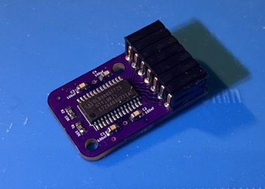
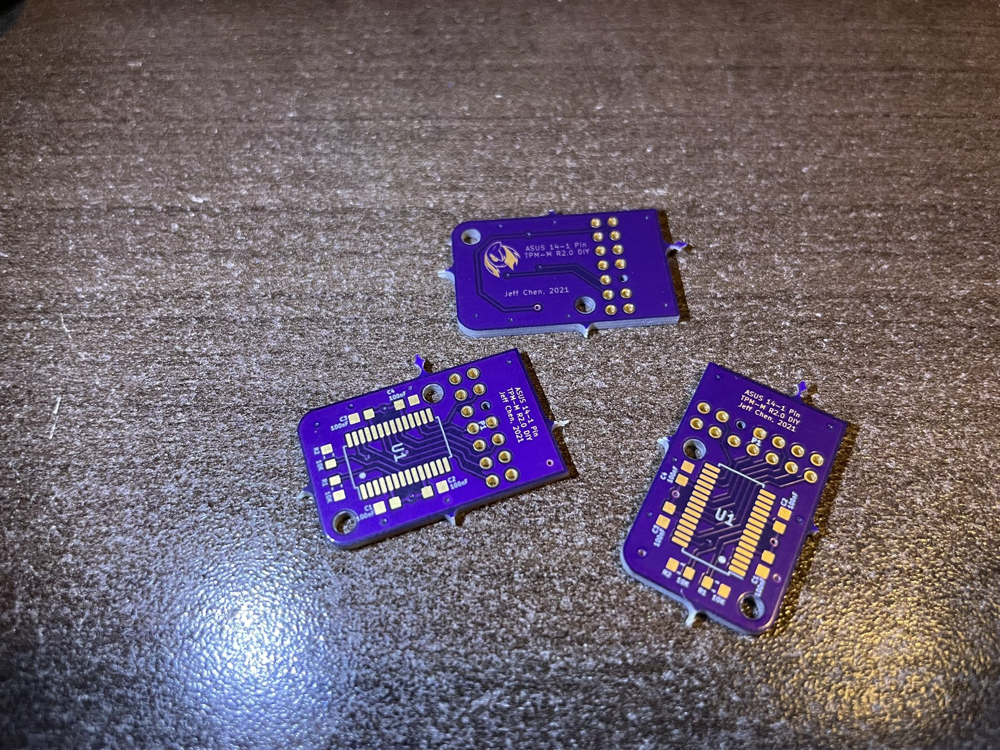
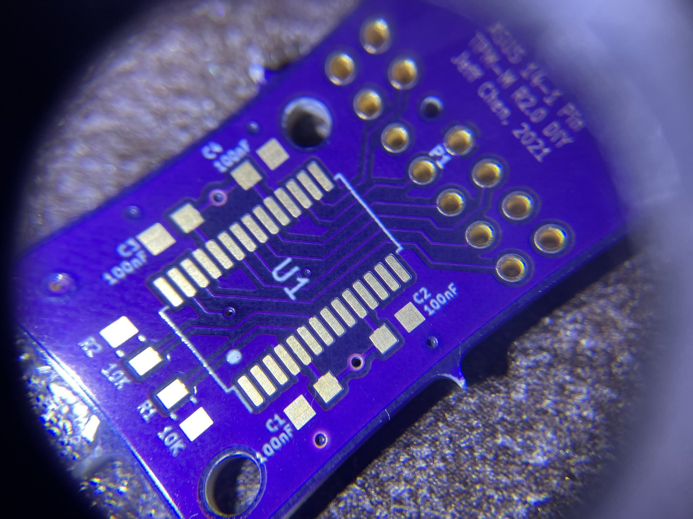
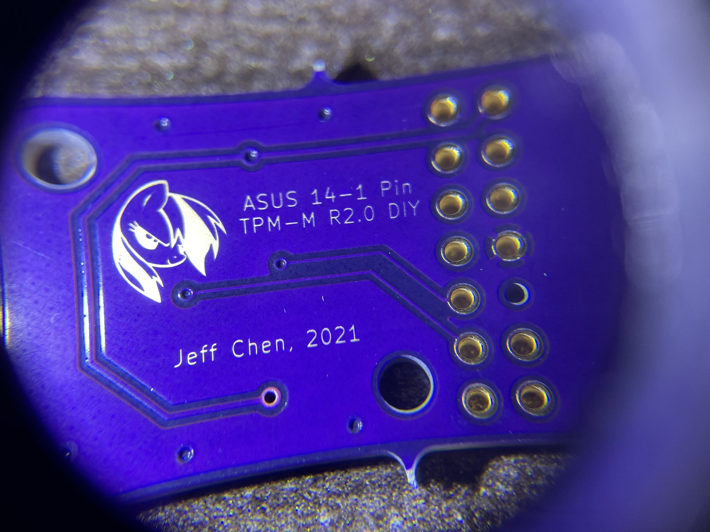
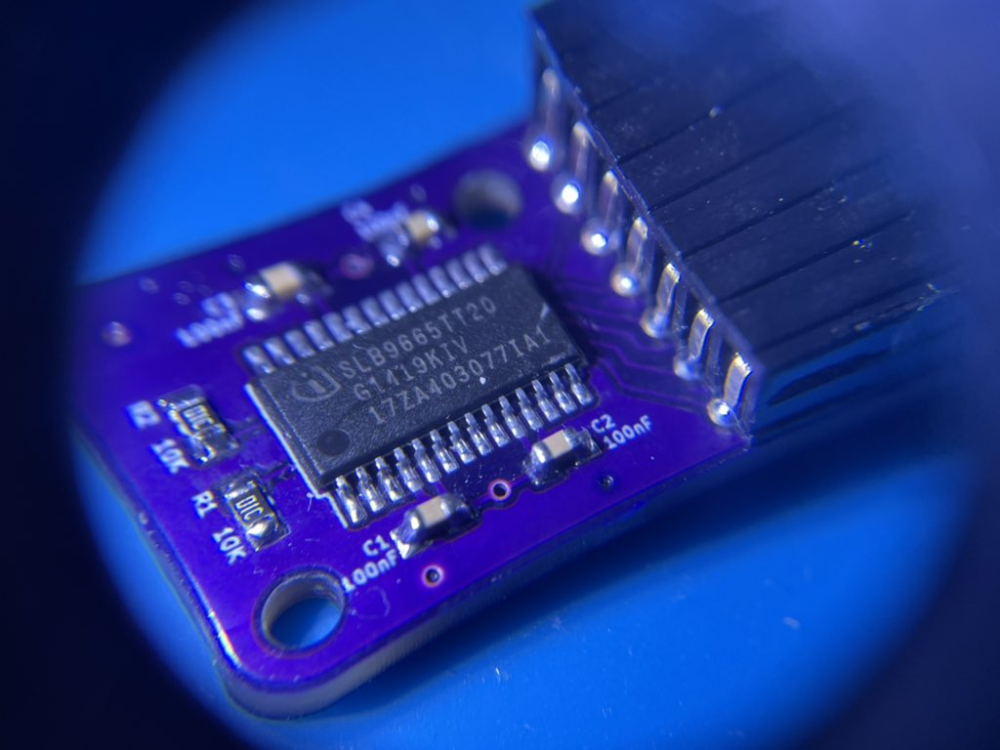
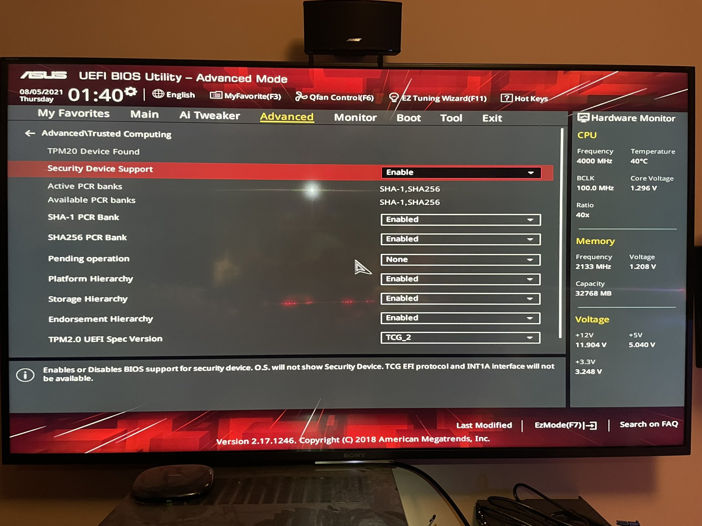

# DIY ASUS TPM-M R2.0 Module

It's kinda hard to find those TPM modules that no one knew they needed - UNTIL Windows 11 happened. So here's one in case you need it.

There are many variants, so please use this as a reference to create your own.

--------

## Parts

SLB9665TT20 TPM Chip:

-  https://www.ebay.com/itm/313526673758

2 mm pitch double row right angle pin header -   Choose the 2x7 option
-  https://www.aliexpress.com/item/32887332295.html

4x 100nF 6.3V 0603 SMD capacitors

2x 10K Ohm 0603 SMD resistors

PCB:
-   https://oshpark.com/shared_projects/pVqwq0NS

Note: You do NOT have to follow the links I used. The specs are pretty laid out so you can source your own parts if you prefer.

3D Printed Shell (Optional)
  - Print with the text facing upwards
  - Suggested layer height: 0.16mm.
  - Suggested line width: 0.35mm.
  - Uses two 6mm M2 screw and nut.
--------

## Assembly

You have to know how to solder VERY well. Experience in soldering TSSOP and SMD components is required.

Note the pin header should be keyed. You can cut a piece of the compatible pin and stuff it into the hole on the bottom row, the 3rd one from the right.

Note: if you are an amateur on soldering, this might not be a bad project to learn how to solder, since everything is quite affordable. Learn how to pre-tin SMD pads for caps and resistor, how to tack a chip in place, and then drag solder alone one side, then the other. We all have to start from somewhere.

--------

## Installation

Jam it onto your motherboard with power turned OFF (I don't have to teach you the basics, right?) For my motherboard, once booted into the BIOS, the chip is automatically recognized and ready to go. Windows 10 also recognized it without any fuss.

--------

## Reference

SLB9665TT20 Datasheet:
- https://www.infineon.com/dgdl/Infineon-data-sheet-SLB9665_2.0_Rev1.2-DS-v01_02-EN.pdf?fileId=5546d462689a790c016929d1d3054feb
